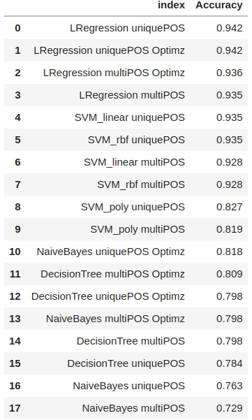

# 
Automatic Ticket Classify

## Table of Contents
1. [General Info](#general-information)
2. [Pipline](#pipelines-that-needs-to-be-performed)
3. [Prepare](#prepare-the-text-for-topic-modeling)
4. [Technologies Used](#technologies-used)
5. [Results](#results)
6. [Acknowledgements](#acknowledgements)
7. [Contact](#contact)

<!-- You can include any other section that is pertinent to your problem -->

## General Information
Based on customer complaint data in the fields of finance, services... 
The classification of complaints with negative, positive, banking, debit card complaints is a necessary issue. classified automatically and requires high accuracy.

Based on the above requirements, we divide into 5 types of complaints as below.

* Credit card / Prepaid card

* Bank account services

* Theft/Dispute reporting

* Mortgages/loans

* Others 

With the knowledge learned about NLP, apply to classify complaints according to specific steps and apply training algorithms. 
From there get the model with the best results.

## Pipelines that needs to be performed:

The steps to build a specific model follow the steps below:

1.  Data loading

2. Text preprocessing

3. Exploratory data analysis (EDA)

4. Feature extraction

5. Topic modelling 

6. Model building using supervised learning

7. Model training and evaluation

8. Model inference

## Prepare the text for topic modeling
* Make the text lowercase
* Remove text in square brackets
* Remove punctuation
* Remove words containing numbers
* Remove symbols are XX, digits...

Cleaning operations and perform the following:
* Lemmatize the texts
* Extract POS tags of lemma text and remove all words not in tag = ['JJ', 'NN', 'NNP', 'UH', 'VB', 'VBG', 'WDT' ]- denoted throughout as multiPOS
* Extract the POS tags of the lemmatized text and remove all the words which have tags other than NN[tag == "NN"]- Is denoted throughout as uniquePOS

- Dataset: __Provided by the Upgrad educational institution__. You can consult and download from [this](https://drive.google.com/file/d/1ETUMAYXD1kpi3ntrhDxDVdkK5WqtMpQ3/view?usp=sharing).

## Technologies Used
* In this project we use some of the following libraries, you can install it according to the version noted in the requirement.txt file.
> Pandas version 1.4.2
Numpy version 	    1.22.3
spacy version       3.4.3
scikit-learn version 0.23.1
wordcloud version           1.8.2.2
seaborn version version     0.11.2
swifter version             1.3.4

## Results
- The performance results and accuracy of the models are listed in the table below
    

## Acknowledgements
- This project was inspired by our group exercise on Kaggle.
- References on [Reference_1](https://www.kaggle.com/datasets/venkatasubramanian/automatic-ticket-classification).  [Reference_2](https://www.kaggle.com/datasets/abhishek14398/automatic-ticket-classification-dataset). [Reference_3](https://www.kaggle.com/code/rajivaiml/automatic-ticket-classification-using-nmf). 

## Contact

Created by : Pham Van Thai: phamthai.ats@gmail.com Feel free to contact us!
- We do not have any constraints about License on the use of our results. You can use it for free.